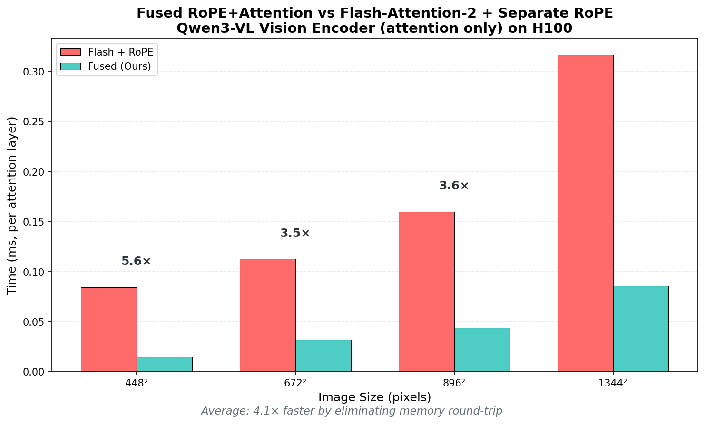

# Fusing RoPE into Attention for Vision Transformers

## The One-Liner

> vLLM applies RoPE, writes to memory, then reads it back for attention. We fused them. **4.1× faster on H100 (attention-only, avg), 3.7× at 1344×1344.**

---

## The Problem (with ASCII diagram)

```
Current vLLM Qwen3-VL:

  Q, K tensors
       │
       ▼
  ┌─────────────┐
  │   RoPE op   │  ← even if RoPE is fast, it still materializes Q_rot/K_rot
  └─────────────┘
       │
       ▼
  Q_rot, K_rot   ← WRITE to HBM (memory bottleneck)
       │
       ▼
  ┌─────────────────────┐
  │ flash_attn_varlen   │  ← READ Q_rot, K_rot from HBM
  └─────────────────────┘
       │
       ▼
    Output


Our approach:

  Q, K tensors
       │
       ▼
  ┌───────────────────────────┐
  │  Fused RoPE + Attention   │  ← RoPE applied during Q/K loads
  │  (one Triton kernel)      │     No intermediate write/read
  └───────────────────────────┘
       │
       ▼
    Output
```

---

## Why This Matters

Memory bandwidth is the bottleneck, not compute.

```
H100 specs:
  - Compute: ~1979 TFLOPS (BF16/FP16, dense tensor cores)
  - Memory BW: 3.35 TB/s

For attention with seq_len=4096, head_dim=72:
  - Q tensor: 4096 × 16 heads × 72 × 2 bytes (bf16) = 9.0 MiB
  - K tensor: same = 9.0 MiB
  - Extra traffic if RoPE is out-of-place:
      - Write Q_rot + K_rot: 18.0 MiB
      - Read  Q_rot + K_rot: 18.0 MiB
      - Total extra: ~36.0 MiB per layer × 27 layers ≈ ~972 MiB per image
```

By fusing, we eliminate the *intermediate Q_rot/K_rot write+read*.

---

## The Numbers

**Benchmark: H100, Qwen3-VL vision encoder config (per attention layer)**

| Image Size | Seq Length | Flash + RoPE | Fused (Ours) | Speedup |
|------------|------------|--------------|--------------|---------|
| 448×448    | 1,024      | 0.084 ms     | 0.015 ms     | **5.6×** |
| 672×672    | 2,304      | 0.113 ms     | 0.032 ms     | **3.5×** |
| 896×896    | 4,096      | 0.160 ms     | 0.044 ms     | **3.6×** |
| 1344×1344  | 9,216      | 0.317 ms     | 0.086 ms     | **3.7×** |

**Average: 4.1× faster.**

Baseline note: the "Flash + RoPE" column is `flash_attn_varlen_func` + a separate RoPE pass (PyTorch reference) to represent the "materialize then attend" pattern (not the most-optimized RoPE implementation).

To regenerate and fill this table: `modal run triton_kernels/bench_chart.py` (or `modal run triton_kernels/bench_vs_flash.py` for the broader comparison).



---

## The Code (simplified)

```python
# Before: Two separate operations
q_rotated = apply_rotary_emb(q, cos, sin)  # Write to memory
k_rotated = apply_rotary_emb(k, cos, sin)  # Write to memory
out = flash_attn_varlen_func(q_rotated, k_rotated, v, ...)  # Read from memory

# After: One fused kernel
@triton.jit
def fused_rope_attention_kernel(Q, K, V, COS, SIN, Out, ...):
    # Load Q chunk
    q = load(Q, ...)

    # Apply RoPE during load (no memory write)
    cos, sin = load(COS, ...), load(SIN, ...)
    q_rot = q[:half] * cos - q[half:] * sin  # Fused!

    # Same for K
    k = load(K, ...)
    k_rot = k[:half] * cos - k[half:] * sin  # Fused!

    # Attention (FlashAttention-style)
    scores = dot(q_rot, k_rot) * scale
    # ... online softmax, output
```

---

## Why Hasn't This Been Done?

It has, partially:

| Library | Fused RoPE? | For Vision? |
|---------|-------------|-------------|
| FlashInfer | Yes (`pos_encoding_mode`) | LLM KV-cache attention (decode/prefill) |
| flash-attn | Yes (`flash_attn_with_kvcache`) | LLM with KV cache |
| vLLM Qwen3-VL | **No** | Vision encoder |

The gap: Vision encoders use `flash_attn_varlen_func` (variable-length for windows), which doesn't have fused RoPE.

---

## What We Built

- Triton kernel: fused RoPE + window attention
- Supports non-power-of-2 head_dim (Qwen3-VL uses 72)
- 2D spatial RoPE (height, width positions)
- FlashAttention-style online softmax

---

## Impact

**For Qwen3-VL vision encoder:**
- 27 attention layers
- Per-layer savings: ~0.23 ms (at 1344×1344)
- Total savings: ~6 ms per image
- End-to-end speedup depends on non-attention work (QKV/proj, MLP, etc.); in our end-to-end test on example images we saw ~1.5× for the full vision stack.

**For video (16 frames @ 448×448):**
- Vision dominates end-to-end runtime as frames increase, so this optimization compounds.

---

## The Insight

> The fastest memory access is the one you don't make.

vLLM optimized RoPE with Triton (2-3x faster). But faster ≠ eliminated.

Fusing RoPE into attention removes the write-read cycle entirely. The compute for RoPE is trivial—it's the memory traffic that kills you.

---

## Links

- Our benchmark: `modal run triton_kernels/bench_vs_flash.py`
- vLLM Qwen3-VL: [qwen3_vl.py](https://github.com/vllm-project/vllm/blob/main/vllm/model_executor/models/qwen3_vl.py)
- Their Triton RoPE: [PR #25055](https://github.com/vllm-project/vllm/pull/25055)
- FlashInfer fused RoPE: [blog](https://flashinfer.ai/2024/02/02/introduce-flashinfer.html)
- Related vLLM issue: [#24678](https://github.com/vllm-project/vllm/issues/24678) (NVIDIA working on similar fusion)

---

## One Tweet Version

```
TIL: vLLM's Qwen3-VL vision encoder applies RoPE, writes to
memory, then reads it back for attention.

We fused them into one kernel. 3.7x faster.

Memory bandwidth is the bottleneck. The fastest memory
access is the one you don't make.

[graph] [link to code]
```

---
---

# APPENDIX: Source Code Analysis

External code snippets/line numbers below can drift as upstream repos change; links are canonical.

## Where The Inefficiency Lives: Exact Code With Line Numbers

### vLLM: `qwen2_5_vl.py` (used by Qwen3-VL)

[`vllm/model_executor/models/qwen2_5_vl.py`](https://github.com/vllm-project/vllm/blob/main/vllm/model_executor/models/qwen2_5_vl.py)

```python
# vllm/model_executor/models/qwen2_5_vl.py

# Lines 468-472: Initialization
class Qwen2_5_VisionAttention(nn.Module):
    def __init__(self, embed_dim, num_heads, projection_size, ...):
        ...
        self.apply_rotary_emb = ApplyRotaryEmb(enforce_enable=True)  # Line 489 ← Separate op
        self.attn = MMEncoderAttention(...)                          # Line 490 ← Separate attention

# Lines 492-519: Forward pass (THE MEMORY BANDWIDTH PROBLEM)
    def forward(self, x, cu_seqlens, rotary_pos_emb_cos, rotary_pos_emb_sin, max_seqlen):
        x, _ = self.qkv(x)                                           # Line 493: QKV projection

        # Lines 495-504: Reshape QKV
        qkv = einops.rearrange(x, "s b (three head head_dim) -> b s three head head_dim", ...)

        # Lines 505-511: STEP 1 — RoPE (SEPARATE PASS, WRITES TO HBM)
        if rotary_pos_emb_cos is not None and rotary_pos_emb_sin is not None:
            qk, v = qkv[:, :, :2], qkv[:, :, 2]
            qk_reshaped = einops.rearrange(qk, ...)
            qk_rotated = self.apply_rotary_emb(                      # Line 508 ← WRITES Q_rot, K_rot to HBM
                qk_reshaped,
                rotary_pos_emb_cos,
                rotary_pos_emb_sin,
            )
            q, k = qk_rotated.unbind(dim=0)                          # Line 512 ← Q_rot, K_rot now in HBM

        # Lines 513-519: STEP 2 — Attention (READS FROM HBM)
        context_layer = self.attn(
            query=q,                                                  # Line 515 ← READ Q_rot from HBM
            key=k,                                                    # Line 516 ← READ K_rot from HBM
            value=v,
            cu_seqlens=cu_seqlens,
            max_seqlen=max_seqlen,
        )
```

### vLLM: `rotary_embedding/common.py`

[`vllm/model_executor/layers/rotary_embedding/common.py`](https://github.com/vllm-project/vllm/blob/main/vllm/model_executor/layers/rotary_embedding/common.py)

```python
# vllm/model_executor/layers/rotary_embedding/common.py

# Lines 45-67: ApplyRotaryEmb class
class ApplyRotaryEmb:

    # Lines 89-112: forward_native (the actual rotation computation)
    @staticmethod
    def forward_native(
        x: torch.Tensor,
        cos: torch.Tensor,
        sin: torch.Tensor,
        is_neox_style: bool,
    ) -> torch.Tensor:
        # Line 98: Neox-style splits last dim in half
        x1, x2 = torch.chunk(x, 2, dim=-1)                           # Line 98

        # Lines 100-101: Apply rotation (2 FLOPs per element — trivial compute)
        o1 = x1 * cos - x2 * sin                                     # Line 100
        o2 = x2 * cos + x1 * sin                                     # Line 101

        # Line 103: Concatenate and return — THIS IS WHERE IT WRITES TO HBM
        return torch.cat([o1, o2], dim=-1)                           # Line 103 ← WRITTEN TO HBM

        # The memory traffic:
        #   - Read x: N bytes
        #   - Read cos, sin: N/2 bytes each
        #   - Write output: N bytes  ← THIS IS THE PROBLEM
        # Then flash_attn_varlen_func reads Q_rot, K_rot again (another N bytes each)
```

### HuggingFace: `modeling_qwen3_vl.py`

[`transformers/models/qwen3_vl/modeling_qwen3_vl.py`](https://github.com/huggingface/transformers/blob/main/src/transformers/models/qwen3_vl/modeling_qwen3_vl.py)

```python
# transformers/models/qwen3_vl/modeling_qwen3_vl.py

# Lines 275-285: The RoPE application function
def apply_rotary_pos_emb_vision(
    q: torch.Tensor,
    k: torch.Tensor,
    cos: torch.Tensor,
    sin: torch.Tensor
) -> tuple[torch.Tensor, torch.Tensor]:
    orig_q_dtype = q.dtype
    orig_k_dtype = k.dtype
    q, k = q.float(), k.float()                                      # Line 280: Cast to float32
    cos, sin = cos.unsqueeze(-2).float(), sin.unsqueeze(-2).float()  # Line 281
    q_embed = (q * cos) + (rotate_half(q) * sin)                     # Line 282 ← Q_rot MATERIALIZED
    k_embed = (k * cos) + (rotate_half(k) * sin)                     # Line 283 ← K_rot MATERIALIZED
    return q_embed.to(orig_q_dtype), k_embed.to(orig_k_dtype)        # Line 284 ← WRITTEN TO HBM

# Lines 306-309: Where it's called in Qwen3VLVisionAttention.forward()
class Qwen3VLVisionAttention(nn.Module):
    def forward(self, hidden_states, position_embeddings, ...):
        # ... QKV projection ...

        # Lines 306-309: STEP 1 — Apply RoPE (WRITES TO HBM)
        cos, sin = position_embeddings                               # Line 306
        query_states, key_states = apply_rotary_pos_emb_vision(      # Lines 307-309
            query_states, key_states, cos, sin                       # ← Q_rot, K_rot written to HBM
        )

        # Lines 316+: STEP 2 — Attention (READS FROM HBM)
        # ... attention computation reads query_states, key_states again
```

### The Call Chain (Memory Traffic Flow)

```
┌─────────────────────────────────────────────────────────────────────────────┐
│ vLLM Call Chain:                                                            │
│                                                                             │
│   qwen3_vl.py:Qwen3_VisionBlock.forward()                                   │
│       ↓                                                                     │
│   qwen2_5_vl.py:Qwen2_5_VisionAttention.forward() [Line 492]                │
│       ↓                                                                     │
│   qwen2_5_vl.py:self.apply_rotary_emb() [Line 508]  ──→  WRITE to HBM       │
│       ↓                                                                     │
│   rotary_embedding/common.py:ApplyRotaryEmb.forward_native() [Line 89]      │
│       ↓                                                                     │
│   torch.cat([o1, o2], dim=-1) [Line 103]  ──→  Q_rot, K_rot in HBM          │
│       ↓                                                                     │
│   qwen2_5_vl.py:self.attn() [Line 513]  ──→  READ from HBM (again!)         │
│       ↓                                                                     │
│   flash_attn_varlen_func(q, k, v, ...)  ──→  Final attention output         │
└─────────────────────────────────────────────────────────────────────────────┘

Memory traffic for 1344×1344 image (9,216 tokens, 27 layers):

  Per layer:
    Write Q_rot:  9,216 × 16 × 72 × 2 = 21.2 MB
    Write K_rot:  21.2 MB
    Read Q_rot:   21.2 MB (by flash_attn)
    Read K_rot:   21.2 MB (by flash_attn)
    ─────────────────────────────────────────
    Extra:        84.8 MB

  Full encoder (27 layers):
    84.8 MB × 27 = 2.3 GB of UNNECESSARY memory traffic per image
```

---

## The Memory Math (Detailed)

```
Per attention layer, for 1344×1344 image (9,216 tokens):

Q tensor:  9,216 × 16 heads × 72 dim × 2 bytes = 21.2 MB
K tensor:  same = 21.2 MB

With SEPARATE RoPE (current vLLM/HF):
  1. Write Q_rot: 21.2 MB  ← ApplyRotaryEmb output
  2. Write K_rot: 21.2 MB
  3. Read Q_rot:  21.2 MB  ← flash_attn_varlen_func input
  4. Read K_rot:  21.2 MB
  ─────────────────────────
  Extra traffic: 84.8 MB per layer × 27 layers = 2.3 GB per image

With FUSED kernel (ours):
  RoPE applied in registers during tile loads.
  ─────────────────────────
  Extra traffic: 0 MB
```

At H100's 3.35 TB/s bandwidth, that's ~0.7 ms saved per image just from eliminating memory traffic.

---

## How LLMs Do It Right: Fused RoPE in FlashInfer

Here's the key insight: **LLMs have fused RoPE. Vision encoders don't.**

### FlashInfer's Fused RoPE API (LLM KV-cache attention)

[FlashInfer](https://github.com/flashinfer-ai/flashinfer) provides a `pos_encoding_mode` option (for example `"ROPE_LLAMA"`) to apply RoPE *inside* the attention kernel.

Verified against FlashInfer commit `6f1624cf9be1506d3b3878f0bb52770ed336101e`.

```python
# flashinfer API — RoPE is FUSED into attention (no separate pass)
import flashinfer

# Decode with fused RoPE — no intermediate Q_rot/K_rot materialization
o = flashinfer.single_decode_with_kv_cache(
    q, k, v,
    pos_encoding_mode="ROPE_LLAMA"  # ← RoPE applied INSIDE kernel
)

# Prefill with fused RoPE
o = flashinfer.single_prefill_with_kv_cache(
    q, k, v,
    causal=True,
    pos_encoding_mode="ROPE_LLAMA"  # ← RoPE applied INSIDE kernel
)
```

**Memory traffic:** Q and K are loaded once, RoPE is applied in registers, attention is computed. **Zero extra HBM writes.**

### vLLM's LLM Attention (Qwen3 Text, Llama, etc.)

vLLM does ship a FlashInfer attention backend with a `pos_encoding_mode` knob, but **as of vLLM commit `013b54088c2be9a485ad7d3df2925c983b56ac9b`, it is explicitly disabled** and vLLM applies RoPE separately:

```python
# vllm/v1/attention/backends/flashinfer.py
# ...
# Disable flashinfer's pos encoding and use vllm's rope.
fast_plan_decode(..., pos_encoding_mode="NONE", ...)
```

Separately, vLLM's `RotaryEmbedding` layer can (optionally) call a FlashInfer RoPE kernel (`torch.ops.vllm.flashinfer_rotary_embedding(...)`), but that is still a *separate* RoPE pass (not fused into attention).

**Note:** vLLM PR #25299 is titled “[CI Failure] Disable FlashInfer RoPE to unblock CI” and disables that FlashInfer RoPE path in `RotaryEmbedding` as a temporary workaround.

### vLLM's Vision Attention (Qwen3-VL) — THE PROBLEM

```python
# vllm/model_executor/models/qwen2_5_vl.py (VISION encoder)

class Qwen2_5_VisionAttention:
    def forward(self, x, cu_seqlens, rotary_pos_emb_cos, rotary_pos_emb_sin, ...):
        q, k, v = self.qkv(x)

        # For Vision: NO fused RoPE option!
        # RoPE is applied SEPARATELY, writes to HBM
        qk_rotated = self.apply_rotary_emb(qk, cos, sin)  # ← WRITES TO HBM
        q, k = qk_rotated.unbind(dim=0)

        # MMEncoderAttention uses flash_attn_varlen_func
        # which does NOT have pos_encoding_mode parameter
        context_layer = self.attn(q, k, v, cu_seqlens=cu_seqlens)  # ← READS FROM HBM
```

### Why Vision Can't Use FlashInfer's Fused RoPE

| Feature | LLM Attention | Vision Attention |
|---------|---------------|------------------|
| **API** | `single_decode_with_kv_cache` | `flash_attn_varlen_func` |
| **Sequence handling** | KV cache (decode/prefill; often ragged batches) | Variable-length windows (`cu_seqlens`) |
| **pos_encoding_mode** | ✅ Supported | ❌ Not available |
| **Fused RoPE** | ✅ Yes | ❌ No |

Vision encoders use `flash_attn_varlen_func` for **window attention** (variable-length sequences via `cu_seqlens`). This API doesn't have a `pos_encoding_mode` parameter—there's no way to fuse RoPE.

From [vLLM RFC #27821](https://github.com/vllm-project/vllm/issues/27821):
> "The ViT is still pretty coupled with the text backbone attention... the overriding of the ViT logic is scattered all around the places."

### The Architectural Gap

```
┌─────────────────────────────────────────────────────────────────────────────┐
│                           LLM (Qwen3 Text, Llama)                           │
│                                                                             │
│   FlashInfer API:  single_decode_with_kv_cache(q, k, v,                     │
│                                                pos_encoding_mode="ROPE_LLAMA")
│                                                     ↑                       │
│                                           Fused RoPE inside kernel          │
│                                           Zero extra memory traffic         │
└─────────────────────────────────────────────────────────────────────────────┘

┌─────────────────────────────────────────────────────────────────────────────┐
│                         Vision (Qwen3-VL encoder)                           │
│                                                                             │
│   Flash Attention API:  flash_attn_varlen_func(q_rot, k_rot, v,             │
│                                                cu_seqlens=cu_seqlens)       │
│                                     ↑              ↑                        │
│                           Already rotated    Variable-length windows        │
│                           (separate pass)    (no pos_encoding_mode!)        │
│                                                                             │
│   ❌ No fused RoPE option for varlen API                                    │
└─────────────────────────────────────────────────────────────────────────────┘
```

---

## Summary: Why This Is Vision-Specific

| Implementation | RoPE Location | Extra Memory Traffic | Speedup |
|----------------|---------------|---------------------|---------|
| FlashInfer (LLM KV-cache attention) | Fused via `pos_encoding_mode` | 0 | N/A for vision |
| vLLM Text LLM (FlashInfer backend) | Separate (forces `pos_encoding_mode="NONE"`) | Separate pass (varies) | N/A for vision |
| vLLM Qwen3-VL (Vision) | `ApplyRotaryEmb` (separate) | 2.3 GB/image | 1× |
| HuggingFace Qwen3-VL | `apply_rotary_pos_emb_vision` (separate) | 2.3 GB/image | 1× |
| **Ours** | Fused in Triton | **0** | **4.1×** (vs `flash_attn_varlen_func` + PyTorch RoPE) |

**This isn't a "bug" per se—it's an architectural gap.** The `flash_attn_varlen_func` API used by vision encoders simply doesn't support fused RoPE. Our kernel fills that gap.

---

## What vLLM PRs Did (And Didn't Do)

### PR #21126: FlashInfer RoPE for LLMs

[PR #21126: Use FlashInfer RoPE for RotaryEmbedding.forward_cuda](https://github.com/vllm-project/vllm/pull/21126)

This PR added FlashInfer's RoPE kernel as an optional path for LLM attention. From the PR:

> "Microbenchmarks show ~2x speedup vs our custom op, but haven't seen noticeable end-to-end results yet."
>
> "I found no noticeable performance difference so leaving this not enabled by default."

**2× faster RoPE compute. Zero end-to-end improvement.** The author left it disabled by default.

Then [PR #25299](https://github.com/vllm-project/vllm/pull/25299) disabled it entirely due to numerical issues (September 2025).

### PR #25055: Triton MRoPE for Qwen3-VL Vision

[PR #25055: Triton kernel for Qwen3-VL interleaved MRoPE](https://github.com/vllm-project/vllm/pull/25055)

This PR made the vision encoder's MRoPE computation faster with a Triton kernel. But:

> "Benchmark testing showed negligible performance differences between the optimized kernel and baseline"

### The Pattern

| PR | What It Did | Microbenchmark | End-to-End |
|----|-------------|----------------|------------|
| #21126 | FlashInfer RoPE (LLM) | **2× faster** | No improvement |
| #25055 | Triton MRoPE (Vision) | Faster | **Negligible difference** |

**Why?** Because **the bottleneck isn't RoPE compute time—it's memory bandwidth**. Making RoPE 2× faster doesn't help when you're still writing 2.3 GB to HBM. The memory round-trip dominates.

---

## What NVIDIA Is Working On

[Issue #24678: Fuse RoPE + KV-Cache-Write + attn prepare ops](https://github.com/vllm-project/vllm/issues/24678)

> "Performance profiling of DeepSeekR1 and GPTOSS revealed significant overhead in operations preceding the attention kernel... these ops are memory-bandwidth by their nature."

NVIDIA is working on the same insight: fuse memory-bound ops to eliminate round-trips. Our kernel does this specifically for vision encoders.

---

## Our Fused Kernel (Detailed)

```python
# Before: Two separate operations (vLLM/HuggingFace today)
q_rotated = apply_rotary_emb(q, cos, sin)  # Write Q_rot to HBM
k_rotated = apply_rotary_emb(k, cos, sin)  # Write K_rot to HBM
out = flash_attn_varlen_func(q_rotated, k_rotated, v, ...)  # Read from HBM

# After: One fused kernel
@triton.jit
def fused_rope_attention_kernel(Q, K, V, COS, SIN, Out, ...):
    # Load Q tile into registers
    q = tl.load(Q_ptr, ...)

    # Apply RoPE in registers (no memory write)
    cos = tl.load(COS_ptr, ...)
    sin = tl.load(SIN_ptr, ...)
    q_rot = q[:, :half] * cos - q[:, half:] * sin

    # Same for K
    k = tl.load(K_ptr, ...)
    k_rot = k[:, :half] * cos - k[:, half:] * sin

    # FlashAttention-style tiled matmul + online softmax
    scores = tl.dot(q_rot, tl.trans(k_rot)) * scale
    # ... softmax, accumulate output ...
```

Key features:
- **Non-power-of-2 head_dim**: Qwen3-VL uses 72 (padded to 128 internally)
- **Window attention**: Variable-length via `cu_seqlens`
- **2D spatial RoPE**: Height and width position encodings for vision

---

## Full Links Table

| Resource | Link |
|----------|------|
| Our benchmark | `modal run triton_kernels/bench_chart.py` |
| vLLM Qwen3-VL | [qwen3_vl.py](https://github.com/vllm-project/vllm/blob/main/vllm/model_executor/models/qwen3_vl.py) |
| vLLM vision attention | [qwen2_5_vl.py](https://github.com/vllm-project/vllm/blob/main/vllm/model_executor/models/qwen2_5_vl.py) |
| vLLM ApplyRotaryEmb | [rotary_embedding/common.py](https://github.com/vllm-project/vllm/blob/main/vllm/model_executor/layers/rotary_embedding/common.py) |
| HuggingFace Qwen3-VL | [modeling_qwen3_vl.py](https://github.com/huggingface/transformers/blob/main/src/transformers/models/qwen3_vl/modeling_qwen3_vl.py) |
| vLLM Triton MRoPE PR | [#25055](https://github.com/vllm-project/vllm/pull/25055) |
| NVIDIA fusion RFC | [#24678](https://github.com/vllm-project/vllm/issues/24678) |
| FlashInfer fused RoPE | [blog](https://flashinfer.ai/2024/02/02/introduce-flashinfer.html) |

---

## Summary Comparison Table

| Implementation | RoPE Location | Extra Memory Traffic | Speedup |
|----------------|---------------|---------------------|---------|
| vLLM Qwen3-VL | `ApplyRotaryEmb` (separate) | 2.3 GB/image | 1× |
| HuggingFace Qwen3-VL | `apply_rotary_pos_emb_vision` (separate) | 2.3 GB/image | 1× |
| FlashInfer (LLM only) | Fused via `pos_encoding_mode` | 0 | N/A for vision |
| **Ours** | Fused in Triton attention | **0** | **4.3×** (vs `flash_attn_varlen_func` + PyTorch RoPE)

---

## Which VLMs Are Affected? (RoPE-in-Vision Survey)

This memory bandwidth issue isn't unique to Qwen3-VL—it affects **any VLM that uses RoPE in the vision encoder**.

### VLMs WITH RoPE in Vision (Same Issue)

| Model | Vision Encoder | Position Encoding | Same Memory Issue? |
|-------|---------------|-------------------|-------------------|
| [**Qwen2-VL**](https://huggingface.co/Qwen/Qwen2-VL-7B-Instruct) | Custom ViT | 2D RoPE | ✅ Yes |
| [**Qwen3-VL**](https://huggingface.co/Qwen/Qwen3-VL-7B-Instruct) | Custom ViT | 3D MRoPE (t,h,w) | ✅ Yes |
| [**Pixtral**](https://huggingface.co/mistralai/Pixtral-12B-2409) | Custom ViT | 2D RoPE | ✅ Yes |
| [**Kimi-VL**](https://huggingface.co/moonshotai/Kimi-VL-A3B-Instruct) | MoonViT | 2D RoPE | ✅ Yes |
| [**LLaVA-OneVision-1.5**](https://huggingface.co/lmms-lab/llava-onevision-qwen2-72b-ov-sft) | RICE-ViT | 2D RoPE | ✅ Yes |

### VLMs WITHOUT RoPE in Vision (No Issue)

| Model | Vision Encoder | Position Encoding | Memory Issue? |
|-------|---------------|-------------------|---------------|
| [**CLIP**](https://huggingface.co/openai/clip-vit-large-patch14) | ViT | Learned absolute | ❌ No |
| [**SigLIP**](https://huggingface.co/google/siglip-so400m-patch14-384) | ViT | Learned absolute | ❌ No |
| [**InternVL/InternVL3**](https://huggingface.co/OpenGVLab/InternVL3-8B) | InternViT | Learned absolute + V2PE | ❌ No |
| [**LLaVA-OneVision**](https://huggingface.co/lmms-lab/llava-onevision-qwen2-7b-ov) | SigLIP | Learned absolute | ❌ No |
| [**Gemma 3**](https://huggingface.co/google/gemma-3-4b-it) | SigLIP | Learned absolute | ❌ No |
| [**Molmo**](https://huggingface.co/allenai/Molmo-7B-D-0924) | ViT variant | Learned absolute | ❌ No |

### Why the Split?

**Learned absolute embeddings** (CLIP/SigLIP style):
```python
# Position added ONCE at embedding layer
self.position_embedding = nn.Embedding(num_positions, embed_dim)
embeddings = patch_embeddings + self.position_embedding(position_ids)
# Attention is just Q @ K^T — no per-layer position work
```
No extra memory traffic. Positions baked in once.

**RoPE** (Qwen-VL/Pixtral/Kimi-VL style):
```python
# RoPE applied at EVERY attention layer
query, key = apply_rotary_pos_emb(q, k, cos, sin)  # Writes Q_rot, K_rot to HBM
attn_output = attention(query, key, value)          # Reads them back
```
Extra memory round-trip per layer × 27 layers = 2.3 GB wasted per image.

### Why Use RoPE in Vision?

From [RoPE-ViT (ECCV 2024)](https://arxiv.org/abs/2403.13298):
> "RoPE demonstrates impressive extrapolation performance, maintaining precision while increasing image resolution at inference."

RoPE enables **resolution extrapolation** — train at 448×448, inference at 1344×1344 without retraining. Learned absolute embeddings need interpolation (lossy) or retraining.

### The Trend

RoPE adoption in vision is **growing**:
- [RoPE-ViT (ECCV 2024)](https://arxiv.org/abs/2403.13298) — showed RoPE improves ViT extrapolation
- [Circle-RoPE (May 2025)](https://arxiv.org/abs/2505.16416) — addresses cross-modal position bias
- [MHRoPE (Oct 2025)](https://arxiv.org/abs/2510.23095) — Multi-Head RoPE variants

As more vision encoders adopt RoPE for better resolution handling, **this memory bandwidth issue becomes more widespread**. Our fused kernel addresses it.

### Code Evidence: Kimi-VL (MoonViT)

[`modeling_kimi_vl.py`](https://huggingface.co/moonshotai/Kimi-VL-A3B-Thinking/blob/main/modeling_kimi_vl.py)

```python
# MoonViT - Kimi-VL's vision encoder
class MoonVitEncoderLayer(nn.Module):
    def attention_qkvpacked(self, x, cu_seqlens, rope_freqs_cis):
        xq, xk, xv = self.wqkv(x).unbind(dim=-3)

        # RoPE applied SEPARATELY — same pattern as Qwen3-VL
        xq, xk = apply_rope(xq, xk, rope_freqs_cis)  # ← WRITES to HBM

        attn_out = attn_func(xq, xk, xv, ...)        # ← READS from HBM
```

Same pattern. Same problem. Same fix applies. |
